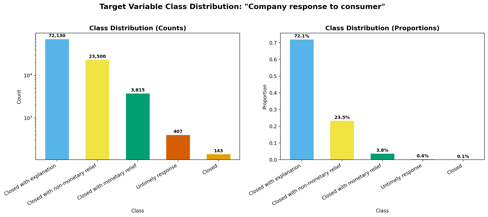
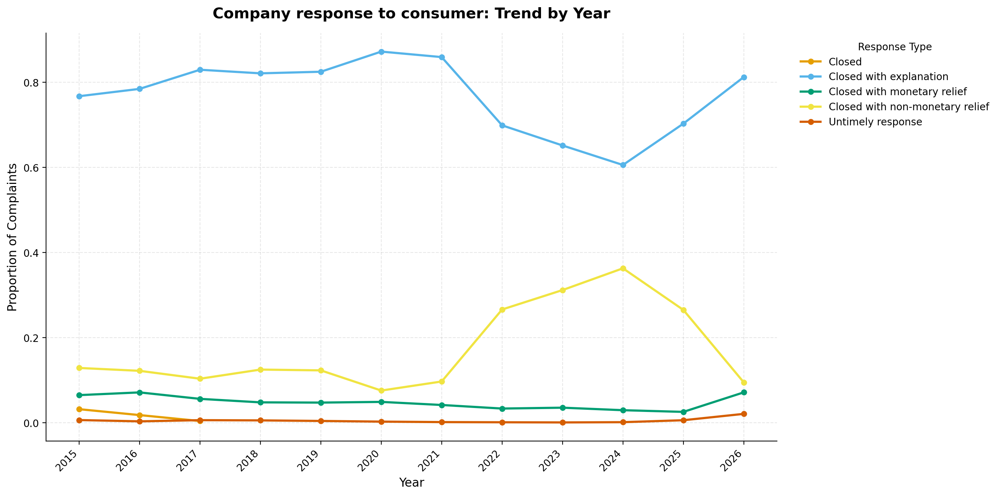
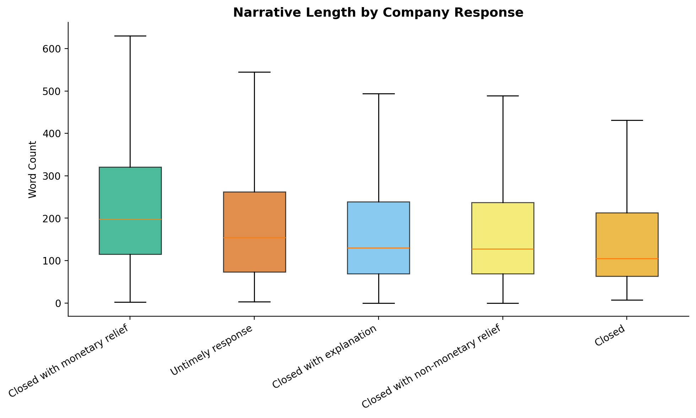
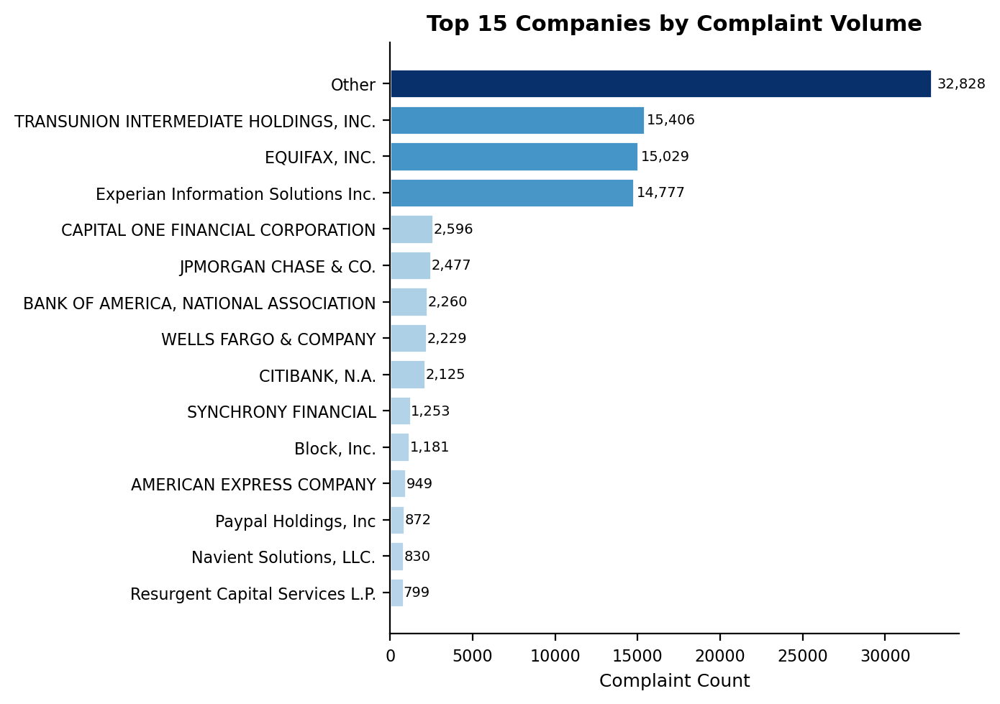
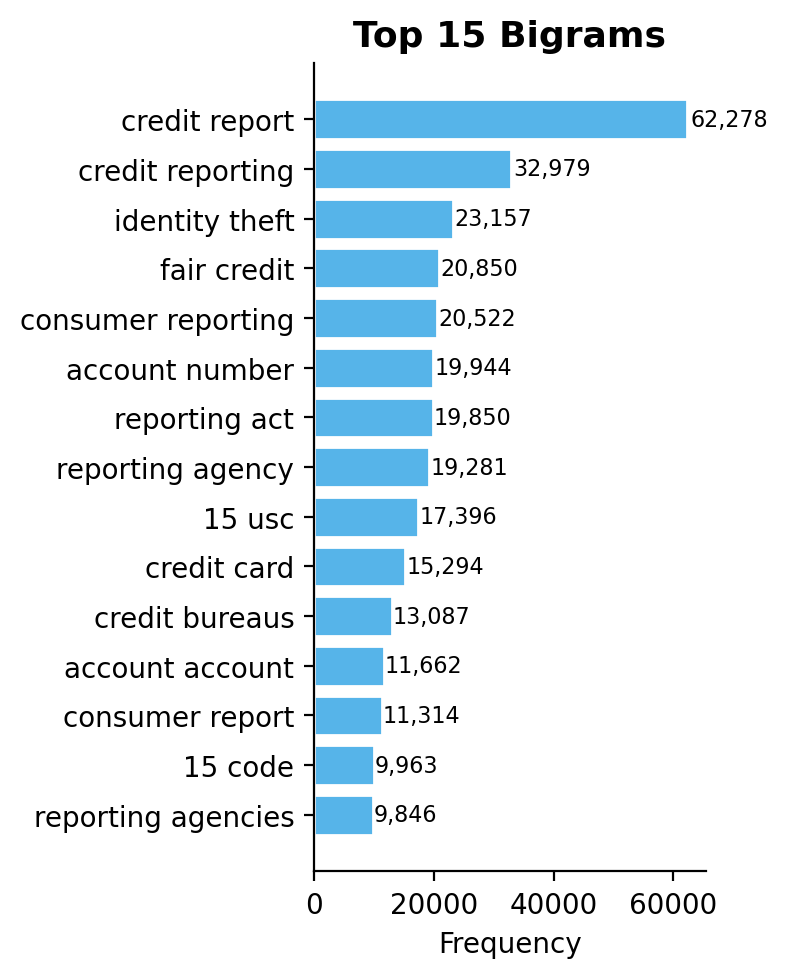
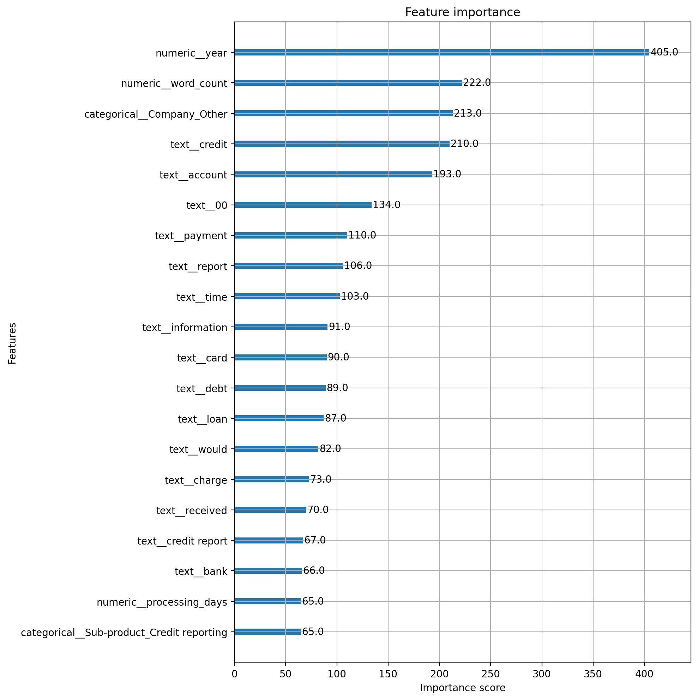
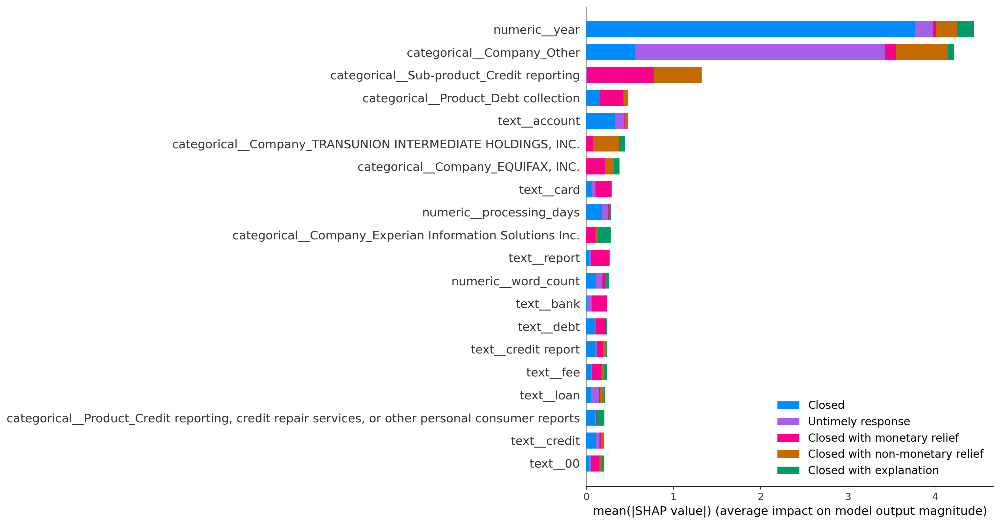
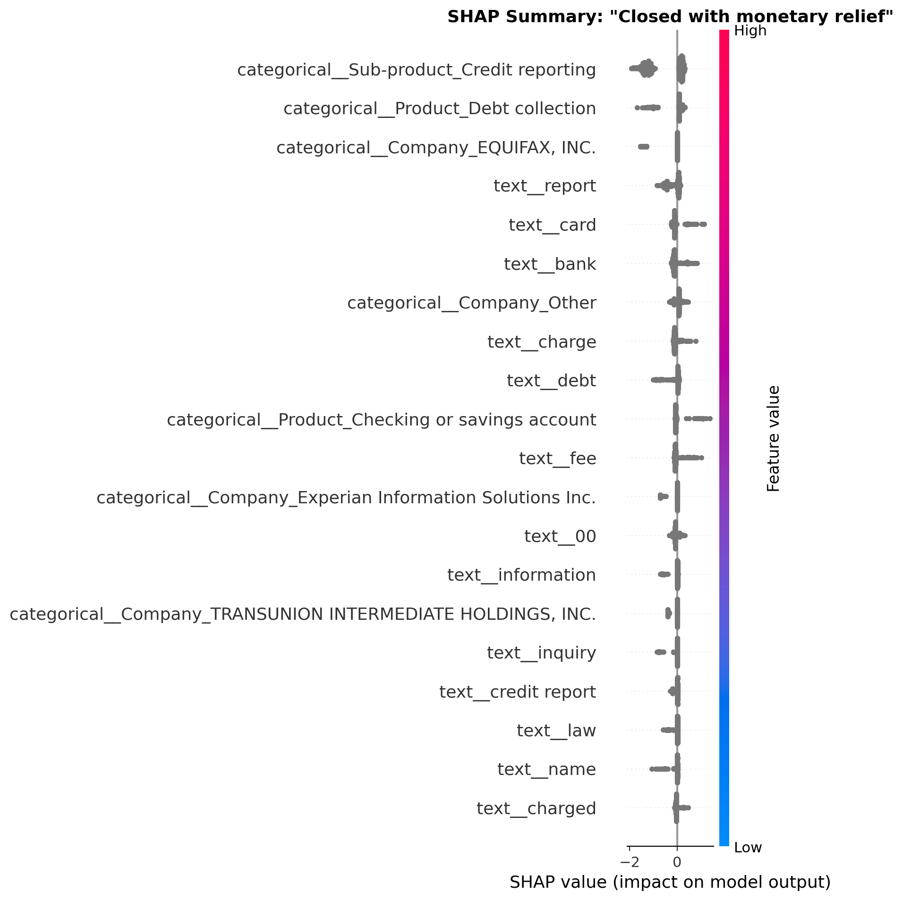
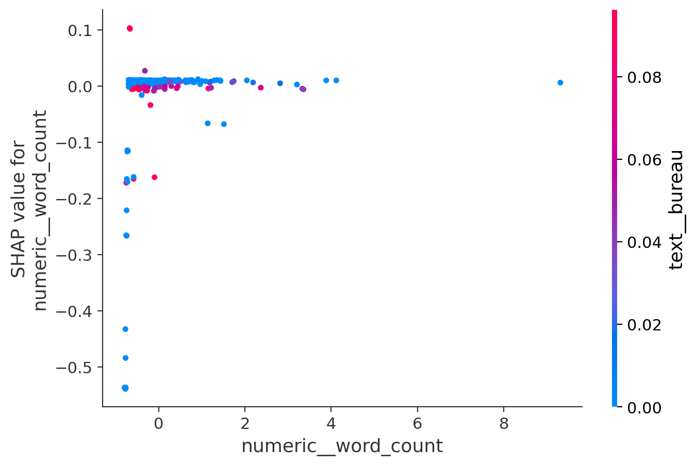
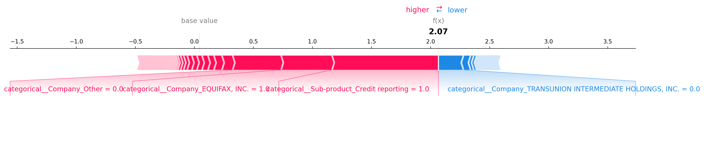

# Finance complaints classification
Predicting how consumer finance complaints get resolved, using user complaints.

## Supervised Learning Task

Predict how a company will resolve a consumer complaint, based on the complaint's
text and associated metadata.
**Target variable:** `Company response to consumer`
**Task type:** Multi-class classification (4 classes after removing rare/unstable
categories)

## Dataset

**Source:** [CFPB Consumer Complaint Database](https://www.consumerfinance.gov/data-research/consumer-complaints/)
**Direct download:** https://files.consumerfinance.gov/ccdb/complaints.csv.zip

The CFPB publishes this data on an ongoing basis, so the total row count
grows daily. As of my data pull (August 2026), the raw dataset contained
approximately 16.5 million complaints across 16 columns, spanning 2013 to
present. I used a stratified sample of 100,000 rows drawn from this full
dataset. 

## How to run a project? 

1. Go to `data_loading.py file`. 
2. Run the command: `python data/data_loading.py` to download raw dataset. 
3. Run the command: `python -m features.preprocessing`. 
4. Run the command: `python -m utils.hyperparameters_tuning` for finding best params with RandomizedSearchCV.
5. Run the command: `python -m models.XGBoost_classifier` for baseline model without hyper parameters tuning + extended model with Hyperopt method for parameters tuning.
6. Run the command: `python -m models.neural_network`.
7. Run the command: `python -m models.extended_neural_network`.
8. 

## Exploratory data analysis
### Target variable distribution

The target variable is heavily imbalanced. "Closed with explanation" accounts
for 72.1% of my sample (72,130 complaints), "Closed with non-monetary relief"
for 23.5%, and the remaining three classes together make up just 4.3%
("Closed with monetary relief" at 3.8%, "Untimely response" at 0.4%, and
"Closed" at only 0.1%, 143 complaints).

I can't rely on accuracy as my evaluation
metric, since a model that always predicted "Closed with explanation" would
already score around 72% accuracy without learning anything real. I used
macro F1 as my primary metric for this reason, and applied class weighting
across all my models to handle the imbalance.

### Class distribution over time

I found that the label distribution shifted substantially over the years my
data spans. "Closed with explanation" stayed above 75% from 2015 through
2020, then dropped sharply to around 60% by 2024, while "Closed with
non-monetary relief" rose from roughly 10% up to 37% over the same period,
before partially reverting in 2025 and 2026. I also noticed the "Closed"
category (without any qualifier) only appears in the earliest years of my
data and disappears entirely after 2017, which told me CFPB's labeling
taxonomy itself changed at some point rather than this being noise.

I concluded from this that pooling all years together means my model is
learning across two somewhat different labeling eras, not one consistent
one. I engineered `year` as a feature partly because of this finding, but I
also flagged it as a real limitation: a model that leans on `year` may not
generalize well to complaints outside my training date range, since it
could be capturing a policy-era artifact rather than something about the
complaint's actual content.

### Narrative length by target class

I found that complaints resulting in "Closed with monetary relief" had a
noticeably higher median word count (around 200 words) and a wider spread
than every other response category, while the other four classes clustered
closer together with medians in the 100-155 word range. I confirmed this
pattern a second way by checking the monetary relief rate specifically
among long complaints (over 526 words, my IQR-based outlier threshold): 6.1%
of long complaints resulted in monetary relief, compared to 3.8% across the
whole dataset, a roughly 60% relative increase.

Since these two checks pointed the same direction independently, I concluded
that narrative length is a genuinely informative signal, not just a
coincidence in this one chart, and engineered `word_count` as a feature for
my classical models based on this finding.

### Top companies by complaint volume

I found the distribution of complaints across companies is extremely
long-tailed. TransUnion, Equifax, and Experian together account for roughly
45,000 of the complaints in my sample, three companies out of thousands
represented in the full dataset. Given this concentration, I decided one-hot
encoding every individual company would have created an unusably sparse
feature space dominated by categories with only one or two examples each,
so I grouped every company outside the top 20 by volume into an "Other"
category before encoding.

### Bigram frequency

Early in this analysis, before I added redaction-token cleaning to my
pipeline, my bigram frequency was dominated by CFPB's `XXXX`/`XX` redaction
placeholders rather than real content, "xxxx xxxx" alone appeared over 1.1
million times. After I added a cleaning step to strip these tokens, the top
bigrams became genuinely informative: "credit report," "identity theft,"
"fair credit," and "credit bureaus" all appear among the most frequent
phrases, which told me the classification task has real, learnable
vocabulary-level signal, particularly around credit reporting disputes,
before I ever trained a model.

### Missing Values

| Column | Missing Count | Missing % |
|---|---|---|
| Tags | 86,859 | 86.89% |
| Company public response | 49,508 | 49.52% |
| Sub-issue | 11,853 | 11.86% |
| Sub-product | 1,934 | 1.93% |
| State | 395 | 0.40% |
| ZIP code | 4 | 0.00% |
| Date received | 0 | 0.00% |
| Product | 0 | 0.00% |
| Issue | 0 | 0.00% |
| Consumer complaint narrative | 0 | 0.00% |
| Company | 0 | 0.00% |
| Submitted via | 0 | 0.00% |
| Date sent to company | 0 | 0.00% |
| Company response to consumer | 0 | 0.00% |
| Timely response? | 0 | 0.00% |
| Complaint ID | 0 | 0.00% |

I dropped `Tags` entirely given how much of it was missing (86.9%), and
because replacing it with synthetic values would have introduced noise into
my training set rather than real signal. I also dropped `Company public
response` despite it being a less extreme 49.5% missing, but for a different
reason: I identified it as a leakage risk, since it reflects the company's
own explanation for how it already handled the complaint, meaning it would
only exist after the resolution decision was made, not before.

For `Sub-issue` and `Sub-product`, I checked whether missingness was random
before deciding how to handle it, and found it wasn't. Certain `Product`
categories, like "Credit reporting" and "Payday loan," had `Sub-product`
missing 100% of the time, while most other products had it present 100% of
the time, with only "Credit card" showing a genuine partial split at 16%
missing. This told me the missingness was structural, not random, so rather
than imputing a mode value or dropping rows, I filled these with
`"Not applicable"`, treating the absence of a sub-category as a meaningful
value in itself rather than a gap to guess at.

For `State`, missingness was low (0.4%) and I filled it with `"Unknown"`
rather than investigating further, given how small a share of the data it
affects.
### Outliers

I checked for outliers in narrative word count using the IQR method. My
upper bound came out to 526 words, and 6,540 rows (6.5% of my sample)
exceeded it, with the single longest complaint running to 6,218 words.

I decided against removing these rows. Since I'd already found that longer
narratives correlate with a higher rate of monetary relief outcomes, I
concluded these "outliers" were more likely genuinely detailed complaints
than data errors, and removing them risked discarding exactly the rows most
associated with my rarer, more important target classes. I did check the
opposite end too, complaints of only one or two words, since those are a
better candidate for being uninformative placeholder text rather than
genuine outliers, but I kept the outlier-length rows as-is and instead
accounted for them practically by choosing a `max_length` for my BERT/neural
network input based on where the bulk of my narratives actually fall (75th
percentile at 257 words), rather than truncating aggressively across the
board.

## Feature Engineering
### Columns I dropped entirely

| Column | Reason |
|---|---|
| `Tags` | 86.9% missing (see Missing Values above) |
| `Company public response` | Leakage risk, reflects the company's explanation for a decision that's already been made, plus ~50% missing/boilerplate |
| `Submitted via` | Constant value in my sampled data (100% "Web"), zero variance, no predictive value |
| `Complaint ID` | Row identifier, no predictive content |
| `Date received`, `Date sent to company` (as raw columns) | Not usable directly by any model, I only retained them through the derived features below |

### Text feature: `Consumer complaint narrative`

This is my primary model input. I applied this cleaning pipeline before
vectorization:

1. **Redaction token removal** - CFPB masks personal information as
   `XXXX`/`XX` placeholders. As I found in my EDA, these dominated my
   n-gram frequency analysis before I cleaned them, so I removed them via
   regex first.
2. **Tokenization** - word-level, via NLTK.
3. **Stopword removal** - standard English stopword list.
4. **Lemmatization** - I reduce words to their dictionary form (e.g.
   "charged" -> "charge"), so inflected forms of the same word aren't split
   into separate vocabulary entries.
5. **Vectorization** - TF-IDF, `max_features=10,000`, unigrams and bigrams.
   I chose this cap after checking my vocabulary composition: the full
   cleaned vocabulary contained 80,333 unique tokens, but 77% appeared five
   times or fewer across my ~100,000-document sample, indicating a long
   tail of rare, non-generalizable terms. I set `max_features=10,000` to
   retain the more frequent, informative portion while excluding this tail.

I only apply this cleaning pipeline to my classical models (Logistic
Regression, XGBoost, feed forward neural network). For my BERT model, I use
raw, uncleaned narrative text with its own subword tokenizer instead, since
stopword removal and lemmatization are known to hurt transformer
performance given these models are pretrained on natural, unprocessed
language.
### Engineered numeric features

- **`word_count`** - narrative length in words. As I found in my EDA,
  complaints resulting in monetary relief had a notably higher median
  length and greater variability than the other outcome categories, and
  long complaints (over 526 words) had a 6.1% monetary relief rate versus
  3.8% overall, a real, converging signal across two separate checks.
- **`processing_days`** - the gap between `Date received` and
  `Date sent to company`. I included this because it's available prior to
  resolution, so there's no leakage concern.
- **`year`** - extracted from `Date received`. My EDA showed a substantial
  shift in the response-label distribution around 2021, so I expected this
  to carry real signal. I flagged a caveat though: this may partly reflect
  a change in CFPB's labeling taxonomy or policy era rather than complaint
  content itself, and a model relying heavily on it may generalize poorly
  outside my training date range. My feature importance analysis later
  showed `year` contributing meaningfully but not dominating, which
  suggested my model relies primarily on text and categorical content
  rather than solely on this temporal artifact.

I standardized all numeric features before feeding them into Logistic
Regression and my neural network. I didn't scale them for XGBoost, since
tree-based splits are unaffected by monotonic transformations.

### Categorical features

- **`Product`, `Sub-product`, `State`** - I one-hot encoded these.
- **`Sub-product`, `Sub-issue`** - as covered in Missing Values, I filled
  these with `"Not applicable"` rather than imputing a mode value, since I
  found the missingness was structural rather than random.
- **`State`** - I filled the small share of missing values with
  `"Unknown"`.
- **`Company`** - as I found in my EDA, this column is extremely
  long-tailed, with the top three companies alone accounting for around
  45,000 complaints in my sample. Rather than one-hot encoding thousands of
  near-unique categories, I grouped every company outside the top 20 by
  volume into an `"Other"` category.

### Feature space summary

My final feature matrix contained 10,187 total features: 10,000 TF-IDF
text features (capped as described above), around 184 one-hot encoded
categorical features across `Product`, `Sub-product`, `State`, and
`Company`, and 3 engineered numeric features (`word_count`,
`processing_days`, `year`).
### Columns I dropped entirely

| Column | Reason |
|---|---|
| `Tags` | 86.9% missing |
| `Company public response` | I identified this as a leakage risk — this field reflects the company's explanation for how it already handled the complaint, so it would only exist *after* the resolution decision, not before. It was also ~50% missing/boilerplate ("Company chooses not to provide a public response") |
| `Submitted via` | Constant value in my sampled data (100% "Web") — zero variance, no predictive value |
| `Complaint ID` | Row identifier, no predictive content |
| `Date received`, `Date sent to company` (as raw columns) | Not usable directly by any model; I only retained them through the derived features below |

### Text feature: `Consumer complaint narrative`

This is my primary model input. I applied this cleaning pipeline before vectorization:
1. **Redaction token removal** — CFPB masks personal information as `XXXX`/`XX`
   placeholders. I found these dominated my n-gram frequency analysis
   (`"xxxx xxxx"` appeared 1.13M times, more than any real word), so I removed
   them via regex before any further processing to avoid polluting the vocabulary.
2. **Tokenization** — word-level, via NLTK.
3. **Stopword removal** — standard English stopword list.
4. **Lemmatization** — I reduce words to their dictionary form (e.g. "charged" →
   "charge"), so inflected forms of the same word aren't split into separate
   vocabulary entries.
5. **Vectorization** — TF-IDF, `max_features=10,000`, unigrams + bigrams. I
   chose this cap after checking my vocabulary composition: the full cleaned
   vocabulary contained 80,333 unique tokens, but 77% appeared five times or
   fewer across my ~100,000-document sample, indicating a long tail of rare,
   non-generalizable terms. I set `max_features=10,000` to retain the more
   frequent, informative portion while excluding this tail.

**Note:** I only apply this cleaning pipeline (steps 1–4) to my classical models
(Logistic Regression, XGBoost). For my fine-tuned DistilBERT model, I use raw,
uncleaned narrative text with BERT's own subword tokenizer instead — stopword
removal and lemmatization are known to hurt transformer performance, since these
models are pretrained on natural, unprocessed language.

### Engineered numeric features

- **`word_count`** — narrative length in words. My EDA showed complaints
  resulting in monetary relief had a notably higher median length (~200 words)
  and greater variability than all other outcome categories; among complaints
  exceeding 526 words (my IQR outlier threshold), the monetary relief rate was
  6.1% versus 3.8% overall — a ~60% relative increase, which is why I included
  this as a feature.
- **`processing_days`** — gap between `Date received` and `Date sent to company`.
  I chose this because it's available prior to resolution, so there's no
  leakage concern.
- **`year`** — extracted from `Date received`. My EDA revealed a substantial
  shift in the response-label distribution around 2021 ("Closed with
  explanation" dropped from ~88% to ~60% of complaints, while "Closed with
  non-monetary relief" rose from ~10% to ~37%), so I expected `year` to carry
  real predictive signal. **Caveat I want to flag:** this may partly reflect a
  change in CFPB's labeling taxonomy or policy era rather than complaint
  content itself, and a model relying heavily on it may generalize poorly to
  complaints outside my training date range. My feature importance analysis
  showed `year` contributing meaningfully (XGBoost importance ≈ 0.0098) without
  dominating the top features, which suggests my model relies primarily on
  text/categorical content rather than solely on this temporal artifact.

I standardized all numeric features (zero mean, unit variance) before feeding
them into Logistic Regression; I didn't scale them for XGBoost, since tree-based
splits are unaffected by monotonic transformations.

### Categorical features

- **`Product`, `Sub-product`, `State`** — I one-hot encoded these.
- **`Sub-product`, `Sub-issue`** — I found the missingness here was structural,
  not random: certain `Product` categories (e.g. "Credit reporting", "Payday
  loan") simply have no sub-category in CFPB's taxonomy, while `Credit card`
  showed a genuine partial split (16% missing). I filled missing values with
  `"Not applicable"` rather than imputing a mode value, to preserve this as a
  meaningful category rather than fabricating a false sub-product.
- **`State`** — I filled the small number of missing values (0.4%) with
  `"Unknown"`.
- **`Company`** — I found this was long-tail distributed (the top 3 companies —
  TransUnion, Equifax, Experian — accounted for roughly 45% of my entire
  sample; thousands of companies appeared only once or twice). Rather than
  one-hot encoding thousands of near-unique categories, I grouped values
  outside the top 20 most frequent companies into an `"Other"` category.

### Feature space summary

My final feature matrix contained 10,187 total features: 10,000 TF-IDF text
features (capped as described above), ~184 one-hot encoded categorical features
across `Product`/`Sub-product`/`State`/`Company`, and 3 engineered numeric
features (`word_count`, `processing_days`, `year`).

### What I considered but didn't include

- **SVD/dimensionality reduction on TF-IDF** — I considered this as a
  potential improvement for XGBoost specifically (tree-based models generally
  handle dense inputs better than very high-dimensional sparse ones), but I
  didn't apply it to my reported models, since I wanted to preserve
  word-level interpretability for feature importance analysis.
- **Frequency encoding for `Company`** (as an alternative to bucketing into
  "Other") — I found this technique used in prior work on this dataset, but I
  didn't implement it here, though I think it's a viable alternative worth
  noting.

## Baseline models
### Extreme Gradient Boosting
I chose XGBoost as my first baseline because it is a strong, well established
model for classification tasks that combine text and tabular features, and it
was one of the model types listed in my assignment as an expected option.

For my input features, I fed XGBoost a combination of TF IDF vectors from the
complaint narrative, one hot encoded categorical columns (Product, Sub product,
State, and Company), and three engineered numeric features (word count,
processing days, and year). I built this whole pipeline as a single scikit
learn Pipeline with a ColumnTransformer, so that text cleaning, vectorization,
and encoding all happen consistently and are always fit only on my training
data, avoiding any leakage into my validation or test sets.

Since my target variable is heavily imbalanced (Closed with explanation makes
up about 72% of my sample, while Untimely response is under 1%), I applied
sample weighting through compute_sample_weight, so that the model is penalized
more for misclassifying my rare classes rather than simply optimizing for the
dominant class.

I also attempted hyperparameter tuning with RandomizedSearchCV, scored on
macro F1 rather than accuracy or weighted F1, since those metrics would still
be dominated by my majority class. I initially tried a full search with 30
candidates and 3 fold cross validation, but individual fits were taking up to
22 minutes each, which made the full search impractical given my timeline. I
reduced the search to a 20,000 row subsample of my training data with a
narrower hyperparameter range and fewer iterations, which brought the search
down to a manageable runtime. Interestingly, the tuned model performed
slightly worse than my untuned baseline (macro F1 of 0.385 versus 0.409), which
I believe reflects both the narrower search space I had to use for speed and
the fact that XGBoost's defaults are already fairly strong for this kind of
data. I kept my baseline model as my reported XGBoost result for this reason,
and documented the tuning attempt as a negative result rather than discarding
it.

### Feed-forward neural network
I chose a feed forward neural network as my second baseline model, since it
gave me a genuinely different architecture to compare against my tree based
model, and Neural Networks (PyTorch/TensorFlow) were explicitly listed as a
valid option in my assignment.

Rather than building a separate feature pipeline for this model, I reused the
exact same ColumnTransformer output I had already built for XGBoost, meaning
the neural network receives the same TF IDF, one hot encoded, and scaled
numeric features. I made this choice deliberately, since it let me isolate the
effect of model architecture on performance, without also changing what
information the model has access to.

Because my feature matrix is dominated by a large, sparse TF IDF matrix
(around 10,000 of my roughly 10,187 total features), I could not simply load
everything into memory as a dense array without using several gigabytes of
RAM. I wrote a small batching function that converts only one batch at a time
from sparse to dense, which kept memory use manageable throughout training.

For class imbalance, I used a weighted CrossEntropyLoss, computed with
compute_class_weight, which is the PyTorch equivalent of the sample weighting
I used for XGBoost.

My first version of this model was a simple two hidden layer network trained
for 10 epochs, which reached a macro F1 of 0.4134 on my test set, my best
result at that point across all models I had tried. When I increased training
to 25 epochs, my validation macro F1 improved noticeably, but my test macro F1
barely moved (0.4134 to 0.4102), with the gains concentrated almost entirely
in my majority class. I took this as a sign that I was reaching a ceiling set
by my class imbalance and data volume, rather than by how long I trained the
model.

Based on that finding, I built an extended version of this model with a deeper
architecture, batch normalization, a learning rate scheduler, early stopping,
and gradient clipping, and I saved its results separately so I could compare
it directly against my simpler baseline rather than overwriting my original
result.
### Generative Large Language Models via API calls

## Evaluation metrics

## Extended models
### Hyperparameter tuned XGBoost

I tuned my baseline XGBoost model using RandomizedSearchCV, scored on macro F1 rather than accuracy or weighted F1, since those would still be dominated by my majority class.

My first attempt used the full search space (30 candidates, 3 fold cross validation, 90 total fits) on my full training set. Individual fits took up to 22 minutes each, which made the full search impractical given my timeline, so I redesigned the search for speed. I moved to a 20,000 row subsample of my training data, narrowed my hyperparameter ranges (particularly max_depth and n_estimators, which I found were the biggest drivers of fit time), and reduced my search to 10 candidates with 2 fold cross validation, bringing the search down to a manageable runtime.

Once I had my best parameters, I retrained a fresh model on my full training set with those parameters applied, since the search itself only ran on the subsample.

My tuned model ended up performing slightly worse than my untuned baseline (macro F1 of 0.385 versus 0.409). I kept my baseline as my reported XGBoost result and documented this as a negative tuning result rather than discarding the attempt.

### Extended feed forward neural network

I built the extended neural network after noticing that training my baseline model for more epochs (10 versus 25) improved my validation macro F1 but barely moved my test macro F1 (0.4134 versus 0.4102), with the gains concentrated almost entirely in my majority class. I took this as a sign I was reaching a ceiling set by class imbalance and data volume, rather than by training duration, so my extended version focused on architectural changes instead of just training longer.

I made four changes compared to my baseline model:

I deepened and widened the network from two hidden layers (256 to 64) to three hidden layers (512 to 128 to 32), giving it more capacity to learn from my 10,187 input features.

I added batch normalization after each hidden layer, which stabilizes training and generally helps the network converge to a better solution.

I lowered my learning rate from 1e-3 to 5e-4 and added a ReduceLROnPlateau scheduler, which automatically shrinks the learning rate once validation macro F1 stops improving, allowing finer convergence than a fixed learning rate.

I added early stopping with a patience of 5 epochs, so training stops automatically once validation macro F1 hasn't improved for 5 consecutive epochs, rather than me having to guess the right number of epochs in advance.
I saved this model's results separately from my baseline, so I could compare the two directly rather than overwriting my original result.

## Models comparison
| Model | Parameters | Macro F1 (Test) | Accuracy (Test) |
|---|---|---|---|
| XGBoost (baseline) | default params, `sample_weight="balanced"` | 0.383 | 0.663 |
| XGBoost (tuned) | RandomizedSearchCV, 10 candidates, 2-fold CV, tuned on a 20,000-row subsample | 0.385 | - |
| Feed-forward NN (baseline) | hidden layers 256, 64; 10 epochs; lr=1e-3 | 0.390 | 0.749 |
| Feed-forward NN (extended) | hidden layers 512, 128, 32; batch norm; lr=5e-4 with scheduler; early stopping | **0.432** | **0.756** |

My extended feed-forward neural network was my best-performing model overall,
improving macro F1 from 0.390 (baseline NN) to 0.432, driven primarily by
better performance on the majority class and "Closed with non-monetary
relief.
## Feature importance

I also checked XGBoost's own feature importance as a second view alongside
SHAP. It mostly agrees: `year` comes out on top again, followed by
`word_count` and `Company_Other`. Real words like `credit`, `account`, and
`report` also show up near the top, which is a good sign, it means the
model isn't only looking at metadata, it's actually using the complaint
text too. One thing that's different from the SHAP chart: `word_count`
ranks higher here (2nd place). That makes sense once you know the two
methods measure different things: this chart counts how often a feature
was used to split the trees, while SHAP measures how much a feature
actually changed each prediction. So a feature can get used a lot without
having a big effect every time.

## Models interpretation with SHAP (SHapley Additive exPlanations)
### Global feature importance across all classes

I found that `year` was the single strongest driver of my XGBoost model's
predictions overall, with `Company_Other` (my bucketed "everything outside
the top 20 companies" category) as the second strongest. Looking at the
color breakdown by class, `year` contributes especially heavily to the
"Closed" and "Closed with non-monetary relief" classes specifically, which
lines up with what I found in my EDA: the response-label distribution
shifted substantially around 2021, so it makes sense the model leans on
this feature for the classes whose prevalence changed the most over time.

This confirmed the caveat I'd already flagged during feature engineering:
`year` is doing real work in this model, more than any single word or
company. I still don't think this is purely an artifact, since
`categorical__Sub-product_Credit reporting` and several real content words
(`account`, `card`, `report`) also rank highly, but it's a limitation worth
being upfront about, a model this dependent on `year` may not generalize
as well to complaints from outside my training window.

### Per-class interpretation: Closed with monetary relief

Looking specifically at what drives predictions toward or away from
"Closed with monetary relief," I found that `Sub-product_Credit reporting`
has a strong negative relationship: when a complaint's sub-product is
credit reporting, that consistently pushes the prediction away from
monetary relief. `Product_Debt collection` shows a similar negative
pattern. On the other hand, individual content words like `card`, `bank`,
`charge`, and `fee` show more mixed, sometimes positive contributions,
which makes intuitive sense given complaints about card fees or bank
charges are more likely to describe a disputed dollar amount than a credit
reporting error is.

### Feature dependence: word count

I looked specifically at how `word_count` relates to its own SHAP
contribution for the "Closed with monetary relief" class, since my EDA had
already flagged narrative length as a meaningful signal. The pattern I
found here was more specific than the EDA boxplot alone showed: it isn't
that longer narratives uniformly push toward monetary relief, it's that
**short, below-average-length narratives carry a much more volatile,
often strongly negative** SHAP contribution (several points reaching -0.3
to -0.5), while narratives at or above average length cluster much closer
to zero impact. In other words, a short complaint isn't neutral, it
actively works against a monetary relief prediction, while a longer one is
closer to indifferent rather than strongly positive on its own. This
refined, rather than contradicted, my earlier EDA finding.

### Error analysis: explaining a misclassified prediction

To move beyond aggregate patterns, I picked an individual complaint my
model misclassified and used a force plot to see exactly which features
drove that specific wrong prediction. For this example, the model's
predicted class was pushed higher primarily by `Company_EQUIFAX, INC. = 1`
and `Sub-product_Credit reporting = 1`, with `Company_Other = 0` also
contributing in the same direction, while `Company_TRANSUNION = 0` pulled
the prediction back down. This tells me that for this particular
complaint, the model leaned heavily on *which company* was involved and
the credit-reporting sub-product, rather than on the specific content of
the narrative itself, which is a plausible explanation for why it got this
one wrong: two different companies handling a similar credit-reporting
complaint don't necessarily resolve it the same way, but the model has
learned company identity as a strong prior regardless.

